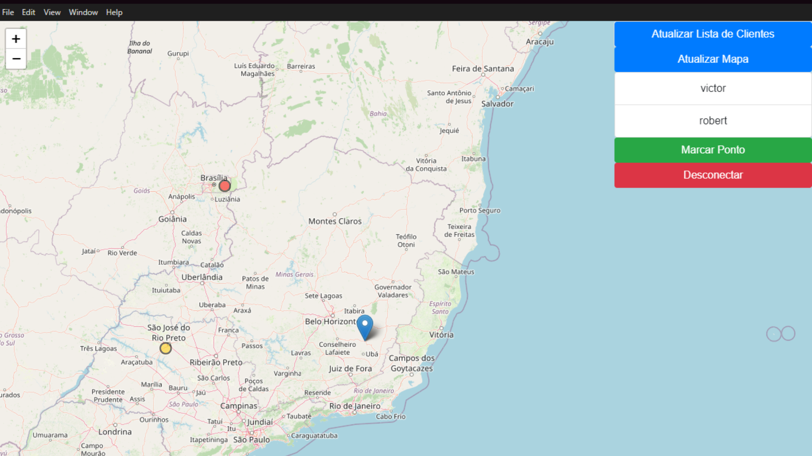
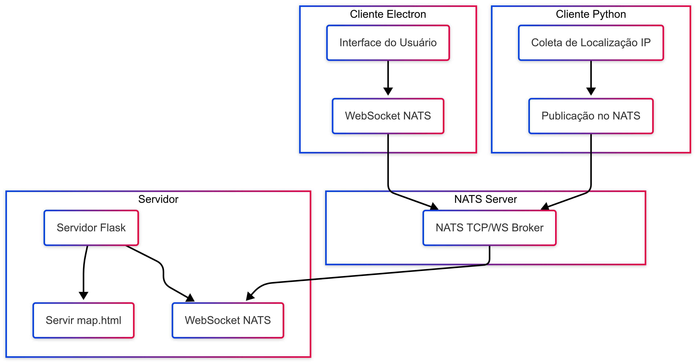

# 🚀 LiveTrack - Compartilhamento de Localização em Tempo Real


---

## 📋 Visão Geral

**LiveTrack** é um sistema distribuído para compartilhamento de localização em tempo real, usando **NATS Server**, **Python**, **Electron** e **Leaflet.js**.

### 🎯 Objetivo
Permitir que amigos visualizem a posição uns dos outros através de um **mapa interativo**, com atualizações automáticas.

---

## 🖼️ Exemplo Visual

### Interface do Sistema:



*Visualização de usuários em tempo real no mapa usando Leaflet.js.*

---

## ⚙️ Tecnologias Utilizadas

- **Backend:** Flask + NATS (Python)
- **Frontend:** Electron + Leaflet.js
- **Comunicação:** NATS (TCP e WebSocket)

---

## 🛠️ Instalação

### Pré-requisitos

- Python 3.x
- Node.js + npm
- NATS Server

### Passos

1. Clonar o projeto:
```bash
git clone https://github.com/seu-usuario/LiveTrack.git
cd LiveTrack
```

2. Instalar dependências:
```bash
pip install flask flask-cors requests nats-py
cd electron-client
npm install
```

3. Iniciar os serviços:
```bash
start_nats.bat
start_server.bat
cd electron-client
npm start
```

---

## 🌐 Arquitetura do Sistema



*Esquema mostrando comunicação entre NATS, Flask, Electron e Browser.*

---

## 🚀 Como Funciona

- O cliente Electron conecta no servidor Flask.
- Localizações são enviadas via NATS a cada 5 segundos.
- As posições são atualizadas em tempo real no mapa.

---

## 📌 Roadmap Futuro

- [ ] Suporte a grupos privados
- [ ] Versão mobile Android/iOS
- [ ] Histórico de localizações
- [ ] Autenticação de usuários

---

## 🤝 Contribuições

Pull requests são bem-vindos!  
Sinta-se à vontade para abrir uma issue ou enviar melhorias.

---

## 📜 Licença

Distribuído sob licença MIT.

---

🔗 **Desenvolvido por Victor Brizante**
